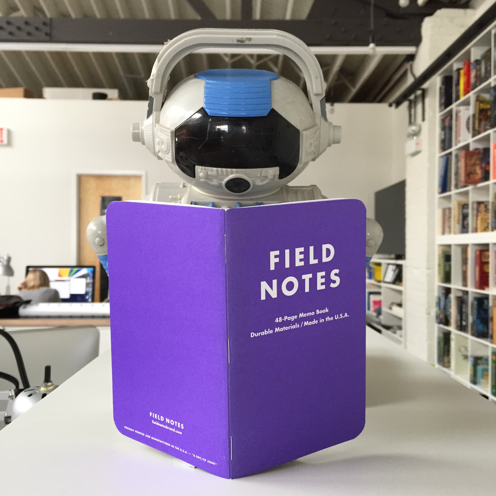

Alex and Savannah discuss vocaloid pop star Hatsune Miku and question the lack of virtual pop star variety.

Here is a picture of Hatsune Miku:

<small>src: <a href="http://google.com">google images</a></small>

Please be careful google image searching her when at work or in public. Rule 34 exists for a reason.

Thank you to Field Notes for sponsoring this episode of Roboism! Visit <a href="http://fieldnotesbrand.com/">fieldnotesbrand.com</a> or <a href="https://www.google.com/maps/place/400+N+May+St,+Chicago,+IL+60642/@41.889238,-87.656064,17z/data=!3m1!4b1!4m2!3m1!1s0x880e2cd65b90cd25:0xde349d43ce0801d7">400 N. May Street</a> in Chicago!

Field notes: for all your analogue note taking purposes.

Also thank you to <a href="http://davidandkevin.bandcamp.com/">David and Kevin</a> for our catchy theme song, "i r robit"
