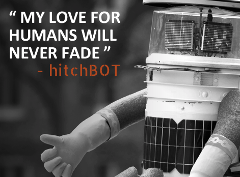

Savannah and Alex are pretty bummed about the demise of Hitchbot and wonder why people are terrible.

Thanks again to [Basecamp](https://basecamp.com/) for sponsoring Roboism in our time of mourning.

<small>src: <a href="http://m.hitchbot.me/">hitchbot's website</a></small>

 

- [Hitchbot says goodbye](http://m.hitchbot.me/)

- [Hitchbot hoaxes](http://paleofuture.gizmodo.com/heres-video-of-the-jerk-who-killed-hitchbot-1721797093)

- [Seriously: Elon Musk is actually afraid of what robots could do](http://www.washingtonpost.com/news/morning-mix/wp/2014/11/18/why-elon-musk-is-scared-of-killer-robots/)

 
> class="twitter-tweet" lang="en">
Oh dear, my body was damaged, but I live on with all my friends. Sometimes bad things happen to good robots! <a href="https://twitter.com/hashtag/hitchBOTinUSA?src=hash">#hitchBOTinUSA</a>
&mdash; hitchBOT (@hitchBOT) <a href="https://twitter.com/hitchBOT/status/627585836515749888">August 1, 2015</a>

